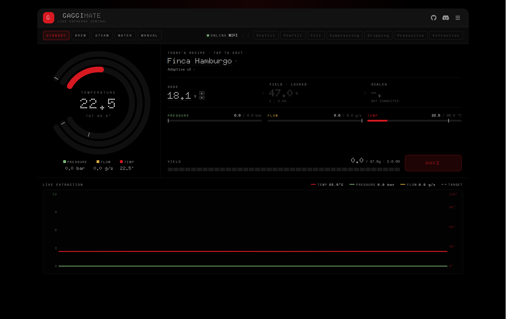
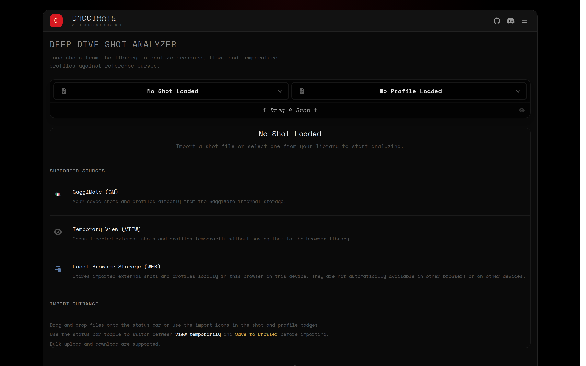
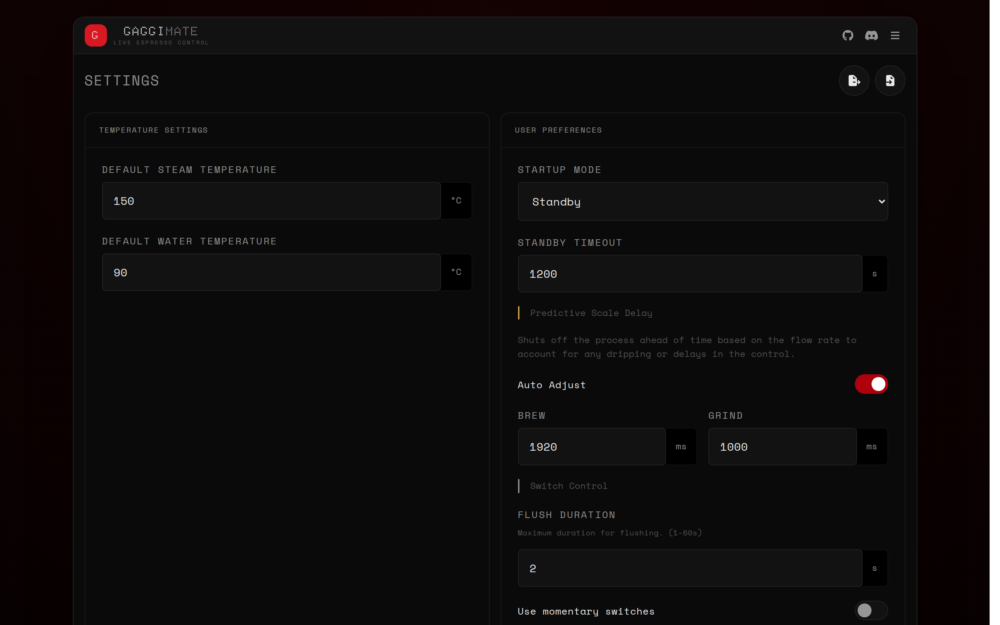
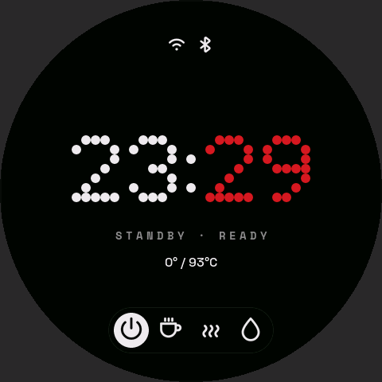
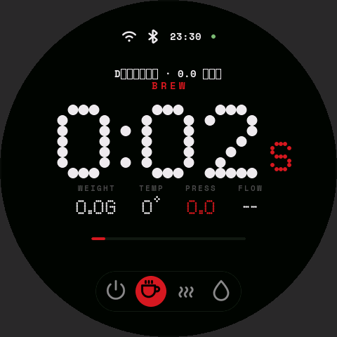

 

[![CC BY-NC-SA 4.0][cc-by-nc-sa-shield]][cc-by-nc-sa]
[![Sonar QG][sonar-shield]][sonar-url]
[![Sonar Violations][sonar-violations]][sonar-url]
[![Sonar Tech Debt][sonar-tech-debt]][sonar-url]

GaggiMate turns a stock Gaggia Classic / Classic Pro into a programmable profiling espresso machine with a touch display, a full web UI, and an open BLE/WebSocket integration surface.

## Features

### Brewing
- **Profile-driven brewing** — Run pre-built or user-authored profiles with per-phase pressure, flow, volumetric or time targets and easeable transitions (`instant` / `linear` / `ease-in` / `ease-out` / `ease-in-out`).
- **Standard *and* Pro profiles** — Simple time/yield profiles for daily use, or full pressure/flow profiles with adaptive transitions for advanced users.
- **Volumetric brewing with predictive shot exit** — A 4-second linear-fit prediction window plus auto-delay learning lands on the target weight without overshoot.
- **Manual mode** — Live pressure, flow and temperature targets you can change mid-shot from the dashboard (available on machines with pressure sensing).
- **All the basics** — Steam, Hot Water, Grind and Flush modes with configurable flush duration, steam pump assist, and optional auto-steam after brew.

### Profile editor
- **Interactive keyframe chart** — Click to add markers, drag horizontally to retime phases, drag vertically to retarget pressure, flow or temperature.
- **Phase form editor** — Per-phase valve, pump mode, targets, transition type and `adaptive` flag.
- **Shot-to-Profile** — Convert any manual shot into a new Pro profile via automatic phase segmentation and flow/pressure mode detection.
- **Library management** — Favourite, drag-to-reorder, duplicate, search, and import/export profiles individually or in bulk.

### Bean library
- On-device bean entries with roaster, roast date/level, origin, process, notes and remaining quantity.
- Auto-deducts the dose from stock at every shot (idempotent across reconnects).
- Archive finished bags — archived beans stay linked to historical shots and are flagged in the shot list.
- JSON import/export.

### Shot history & analytics
- **Binary shot log** on LittleFS/SD with per-phase transition metadata and per-shot notes, ratings and bean linkage.
- **Shot Analyzer** — Multi-shot overlay charts, predictive exit-reason detection, per-phase metrics and chart export.
- **Statistics dashboard** — Trends, summary cards and per-profile / per-phase breakdowns with shareable deep links.
- **Browser-side IndexedDB library** — Imported shots are usable offline alongside the device's history.
- **visualizer.coffee upload** — One-click upload of any shot with notes and profile metadata.

### Connectivity & integrations
- **Web UI** — Preact app served from the device or hosted on GitHub Pages, with a documented WebSocket API (see [docs/websocket-api.yaml](docs/websocket-api.yaml)), exponential-backoff reconnect, and four selectable themes (midnight, espresso, matcha, blueprint).
- **Cloud Relay** — Optional token-based WebSocket relay for reaching your machine from outside the LAN.
- **Bluetooth scales** — Plug-and-play scale support with a 1.5-second grace period for switching between scale weight and flow estimation, and a 5-second steam grace window that keeps the scale connected after a shot to capture the final drips before steaming.
- **Apple HomeKit** — Exposes the machine as a HomeKit Thermostat accessory.
- **Home Assistant** — mDNS auto-discovery plus an optional MQTT bridge.

### Hardware
- **Three supported displays** auto-detected at boot — LilyGo T-RGB, AMOLED, and Waveshare round panels.
- **PID with flow-based thermal feedforward** and on-demand autotune, results streamed back over BLE.
- **Pressure sensor + dimmed pump** for closed-loop pressure / flow control.
- **TOF water-level sensor** with low-water warnings.
- **Auxiliary relay** configurable as Smart Grind (HTTP), boiler fill, or a generic SSR2 output.
- **Sunrise LED** with RGB+W and configurable external brightness.

### Automation
- **Auto-wakeup scheduler** — Per-day-of-week wake schedules to bring the machine up before you do.
- **Configurable standby** with a separate dimming timeout.
- **NTP time sync** with timezone selection and 12/24-hour format.

### Backups & updates
- **OTA updates** for both the display and controller firmware, with `latest` (stable), `beta` (tracks the master branch) and `nightly` channels plus the ability to pin a specific release tag (fork-aware version handling).
- **BLE OTA DFU** as a recovery channel for the controller MCU.
- **Google Drive backup** of profiles, beans and settings, with versioned bundles and one-click restore.
- **Local JSON backup** of the same bundle for offline storage.

### Safety & reliability
- Plugin-based event core (`PluginManager`) with mutex-protected `ProcessSnapshot` for safe UI/plugin access.
- Thermal-runaway, BLE comms timeout and watchdog protections with typed error codes.
- **Headless build** (`pio run -e display-headless`) for boards without a display, with an 8 MB flash variant.

## Build targets

| Environment | Purpose |
|-------------|---------|
| `display` | Full firmware with LVGL UI for the supported display panels |
| `display-headless` | Firmware without the UI (for boards without a display) |
| `display-headless-8m` | Headless variant for 8 MB flash boards (Seeed XIAO ESP32-S3) |
| `controller` | Firmware for the GaggiMate controller MCU |
| `display-sim` | Desktop simulator — builds the display firmware natively with SDL2 for development (no hardware required) |
| `native` / `native-sanitize` | Host unit-test environments (the latter under AddressSanitizer + UBSan) |

The web UI lives in `web/` and is built separately with Vite. It is gzipped and embedded directly into the display firmware's application partition via `scripts/build_webui.sh` (which runs the Vite build and `scripts/embed_webui.py`); see [AGENTS.md](AGENTS.md) for the full build flow.

## Screenshots and Images

### Web UI

### Display & hardware

### How to buy

You can buy your kit on https://shop.gaggimate.eu/

## How It Works

The display drives the brewing process — running profiles, controlling the pump and valve via the controller MCU over BLE, reading the boiler thermocouple and pressure sensor, and broadcasting live state to the web UI over WebSockets. If the machine becomes unresponsive or the temperature climbs out of safe range, the heater is shut off and the machine forces standby.

## Docs

End-user documentation (sourcing, assembly, setup) lives at [https://gaggimate.eu/](https://gaggimate.eu/).

Additional reference material in this repo:

- [docs/websocket-api.yaml](docs/websocket-api.yaml) — WebSocket API reference
- [docs/shot-notes-api.md](docs/shot-notes-api.md) — Shot-notes endpoint contract
- [docs/ble-pairing.md](docs/ble-pairing.md) — BLE pairing and recovery
- [AGENTS.md](AGENTS.md) — Build system, formatting and architecture notes
- [CONTRIBUTING.md](CONTRIBUTING.md) — Contribution guidelines

## License

This work is licensed under CC BY-NC-SA 4.0. To view a copy of this license, visit https://creativecommons.org/licenses/by-nc-sa/4.0/

[sonar-violations]: https://img.shields.io/sonar/blocker_violations/jniebuhr_gaggimate?server=https%3A%2F%2Fsonarcloud.io&style=for-the-badge
[sonar-shield]: https://img.shields.io/sonar/quality_gate/jniebuhr_gaggimate?server=https%3A%2F%2Fsonarcloud.io&style=for-the-badge
[sonar-tech-debt]: https://img.shields.io/sonar/tech_debt/jniebuhr_gaggimate?server=https%3A%2F%2Fsonarcloud.io&style=for-the-badge
[sonar-url]: https://sonarcloud.io/project/overview?id=jniebuhr_gaggimate
[cc-by-nc-sa]: http://creativecommons.org/licenses/by-nc-sa/4.0/
[cc-by-nc-sa-image]: https://licensebuttons.net/l/by-nc-sa/4.0/88x31.png
[cc-by-nc-sa-shield]: https://img.shields.io/badge/License-CC%20BY--NC--SA%204.0-lightgrey.svg?style=for-the-badge
